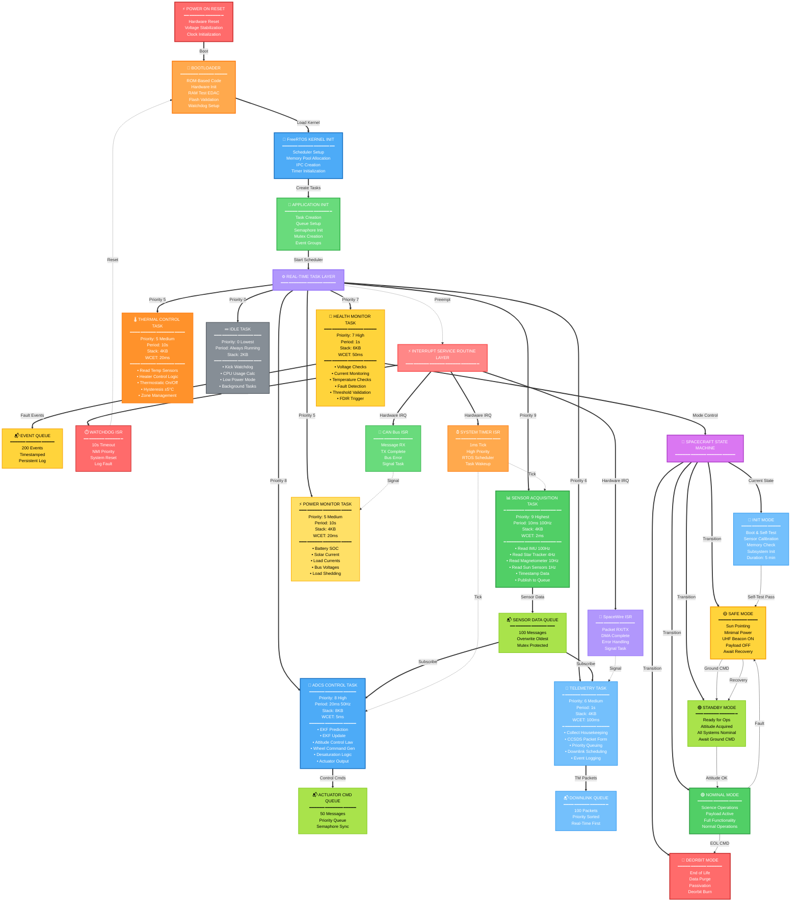
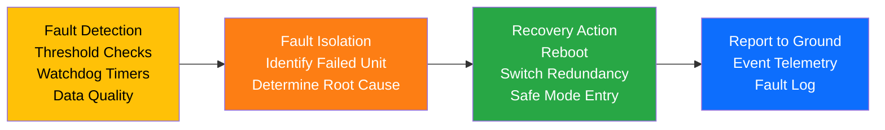

# Spacecraft Avionics Architecture
## LEO Earth Observation Satellite - Technical Portfolio

[](https://github.com)
[](https://github.com)
[](https://github.com)
[](https://github.com)

---

## 📋 Mission Overview

This repository documents a complete spacecraft avionics architecture for a **250 kg Low Earth Orbit (LEO) Earth Observation satellite** designed for professional space missions.

### Key Mission Parameters

| Parameter | Value |
|-----------|-------|
| **Spacecraft Mass** | 250 kg |
| **Orbit** | 500-700 km Sun-Synchronous Orbit (SSO) |
| **Inclination** | ~97.4° (sun-synchronous) |
| **Mission Lifetime** | 5 years |
| **Primary Power Bus** | 28V regulated |
| **Attitude Accuracy** | ≤0.1° (3-axis) |
| **Position Accuracy** | ≤100m (GPS-based) |
| **Data Rate** | 2 Mbps S-band downlink |
| **Reliability Target** | >95% mission success |

### Mission Objectives

- High-resolution Earth observation with multispectral imaging
- Autonomous attitude determination and control
- Fault-tolerant distributed avionics architecture
- Radiation-hardened electronics for 5-year LEO operation
- ECSS/CCSDS standards compliance

---

## 🛰️ Spacecraft Visual Architecture

```
                                    ╔═══════════════════════════════════════╗
                                    ║    ⭐ STAR TRACKER 2 (REDUNDANT)     ║
                                    ╚═══════════════════════════════════════╝
                                                    │
                    ╔═══════════════════════════════╧═══════════════════════════════╗
                    ║                         -Z FACE (ZENITH)                      ║
                    ║  ⭐ STAR TRACKER 1    ☀️ SUN SENSORS x5    🧭 MAGNETOMETERS  ║
                    ╚═══════════════════════════════╤═══════════════════════════════╝
                                                    │
        ╔═══════════════════════════════════════════╧═══════════════════════════════════════════╗
        ║                                                                                         ║
        ║                            SPACECRAFT BUS (250 KG)                                      ║
        ║                         500-700 KM SUN-SYNCHRONOUS ORBIT                                ║
        ║                                                                                         ║
        ║    ┌─────────────────────────────────────────────────────────────────────────┐        ║
        ║    │                                                                           │        ║
☀️═══════╬════╡  SOLAR PANEL +Y                  CENTRAL AVIONICS BAY                  ╞════╬═══════☀️
180W BOL ║    │  Triple-Junction                                                       │    ║ 180W BOL
DEPLOYED ║    │  GaAs Cells                   ┌─────────────────────┐                  │    ║ DEPLOYED
        ║    │  3x Deployable                 │  💻 OBC-A PRIMARY   │                  │    ║
        ║    │                                │  RAD750 / LEON3FT   │                  │    ║
        ║    │                                │  2GB RAM + 64GB     │                  │    ║
        ║    │                                └─────────────────────┘                  │    ║
        ║    │                                                                           │    ║
        ║    │                                ┌─────────────────────┐                  │    ║
        ║    │  📡 S-BAND                     │  💻 OBC-B BACKUP    │                  │    ║
        ║    │  ANTENNA                       │  Cold Redundant     │                  │    ║
        ║    │  Patch Array                   └─────────────────────┘                  │    ║
        ║    │  6 dBi                                                                   │    ║
        ║    │                                ┌─────────────────────┐                  │    ║
        ║    │                                │  ⚡ PCDU             │                  │    ║
        ║    │  ❄️ RADIATOR                  │  Power Distribution │                  │    ║
        ║    │  0.6 m²                        │  28V → 12V/5V/3.3V  │                  │    ║
        ║    │  ε = 0.85                      └─────────────────────┘                  │    ║
        ║    │                                                                           │    ║
        ║    │                                ┌─────────────────────┐                  │    ║
        ║    │                                │  🔋 Li-Ion BATTERY  │                  │    ║
        ║    │                                │  100 Wh @ 28V       │                  │    ║
        ║    │                                │  Thermal Control    │                  │    ║
        ║    │                                └─────────────────────┘                  │    ║
        ║    │                                                                           │    ║
        ║    │  INTERNAL COMPONENTS:                                                    │    ║
        ║    │  • 🎯 IMU (100 Hz)              • 🌐 GPS x2 (Hot Redundant)            │    ║
        ║    │  • ⚙️ Reaction Wheels x4        • 🔄 Magnetorquers x3                  │    ║
        ║    │  • 📡 S-Band Transceiver x2     • 🌡️ Temp Sensors x20                 │    ║
        ║    │  • 🔥 Heater Zones x8           • 💾 Mass Memory 64GB                  │    ║
        ║    │                                                                           │    ║
        ║    └─────────────────────────────────────────────────────────────────────────┘    ║
        ║                                                                                     ║
        ╚═════════════════════════════════════╤═══════════════════════════════════════════════╝
                                              │
                    ╔═════════════════════════╧═════════════════════════╗
                    ║              +Z FACE (NADIR POINTING)             ║
                    ║                                                   ║
                    ║         📷 MULTISPECTRAL CAMERA                   ║
                    ║         10m GSD | 5 Spectral Bands               ║
                    ║         12-bit Depth | JPEG2000                  ║
                    ║                                                   ║
                    ║         📸 PAYLOAD PROCESSOR                      ║
                    ║         Image Compression | 80W                  ║
                    ╚═══════════════════════════════════════════════════╝
                                              │
                                              ▼
                                        🌍 EARTH
                                    (500-700 km below)


        ╔═══════════════════════════════════════════════════════════════════════════╗
        ║                         SPACECRAFT SPECIFICATIONS                         ║
        ╠═══════════════════════════════════════════════════════════════════════════╣
        ║  Mass:              250 kg                                                ║
        ║  Dimensions:        1.2m × 1.2m × 1.5m (stowed)                          ║
        ║  Solar Span:        4.5m (deployed)                                      ║
        ║  Power:             180W BOL → 162W EOL                                  ║
        ║  Attitude:          3-axis stabilized, ≤0.1° accuracy                   ║
        ║  Orbit:             500-700 km SSO, 97.4° inclination                   ║
        ║  Mission Life:      5 years                                              ║
        ║  Data Rate:         2 Mbps S-band downlink                               ║
        ║  Redundancy:        Dual OBC, Dual Transceivers, Dual Star Trackers     ║
        ╚═══════════════════════════════════════════════════════════════════════════╝


        ╔═══════════════════════════════════════════════════════════════════════════╗
        ║                      SUBSYSTEM LOCATION REFERENCE                         ║
        ╠═══════════════════════════════════════════════════════════════════════════╣
        ║  +Z FACE (NADIR):    Payload Camera, Payload Processor                   ║
        ║  -Z FACE (ZENITH):   Star Trackers x2, Sun Sensors x5                    ║
        ║  +X/-X FACES:        Solar Panels (Deployable)                           ║
        ║  +Y/-Y FACES:        S-Band Antennas, Radiators                          ║
        ║  CENTRAL BAY:        OBC-A, OBC-B, PCDU, Battery, Memory                 ║
        ║  DISTRIBUTED:        IMU, GPS, Magnetometers, Reaction Wheels            ║
        ║                      Magnetorquers, Heaters, Temperature Sensors         ║
        ╚═══════════════════════════════════════════════════════════════════════════╝
```

---

## 🏗️ System Architecture

### Architecture Philosophy


The avionics system employs a **hybrid centralized-distributed architecture** with:

- **Dual-redundant On-Board Computer (OBC)** - Cold redundant configuration
- **Distributed sensor interfaces** - Reduced harness mass and EMI
- **Modular subsystem design** - Fault containment and scalability
- **Multiple data bus protocols** - SpaceWire, CAN, I²C, SPI optimized for each application

---

## �️ Spacecraft Physical Architecture

```mermaid
graph TB
    subgraph SPACECRAFT["🛰️ 250 KG LEO EARTH OBSERVATION SATELLITE"]
        subgraph STRUCTURE["SPACECRAFT BUS STRUCTURE"]
            
            subgraph TOP["▲ +Z FACE - NADIR POINTING"]
                PAYLOAD_CAM["📷 MULTISPECTRAL CAMERA<br/>10m GSD<br/>Payload Bay"]
            end
            
            subgraph CENTER["■ CENTRAL AVIONICS BAY"]
                OBC_PRIMARY["💻 OBC-A PRIMARY<br/>RAD750/LEON3FT<br/>2GB RAM + 64GB Flash<br/>12W @ 5V"]
                OBC_BACKUP["💻 OBC-B BACKUP<br/>Cold Redundant<br/>Crosslink to OBC-A"]
                PCDU_MAIN["⚡ PCDU<br/>Power Distribution<br/>28V → 12V/5V/3.3V"]
                MEMORY["💾 MASS MEMORY<br/>64 GB Solid State<br/>SpaceWire Interface"]
            end
            
            subgraph SIDES["◆ SIDE PANELS +X/-X/+Y/-Y"]
                SOLAR_PANELS["☀️ SOLAR ARRAYS<br/>3x Deployable Panels<br/>180W BOL<br/>Triple-Junction GaAs"]
                RADIATORS["❄️ THERMAL RADIATORS<br/>0.6 m² Total Area<br/>ε = 0.85"]
                ANTENNAS["📡 S-BAND ANTENNAS<br/>Patch Arrays<br/>6 dBi Gain"]
            end
            
            subgraph BOTTOM["▼ -Z FACE - ZENITH"]
                STAR_TRACK["⭐ STAR TRACKERS x2<br/>0.1° Accuracy<br/>4 Hz Update<br/>Hot Redundant"]
                SUN_SENS["☀️ SUN SENSORS x5<br/>4π Coverage<br/>0.5° Accuracy"]
            end
            
            subgraph INTERNAL["⚙️ INTERNAL COMPONENTS"]
                BATTERY["🔋 Li-Ion BATTERY<br/>100 Wh Capacity<br/>28V Nominal"]
                IMU_UNIT["🎯 IMU<br/>100 Hz Sampling<br/>0.05°/hr Bias"]
                GPS_UNITS["🌐 GPS RECEIVERS x2<br/>10m Accuracy<br/>Hot Redundant"]
                MAG_UNITS["🧭 MAGNETOMETERS x2<br/>5 nT Accuracy<br/>Hot Redundant"]
                RW_UNITS["⚙️ REACTION WHEELS x4<br/>Pyramid Configuration<br/>0.5 Nm Torque"]
                MTQ_UNITS["🔄 MAGNETORQUERS x3<br/>5 A·m² Dipole<br/>LEO Desaturation"]
                SBAND_TX["📡 S-BAND XCVR x2<br/>2 Mbps Downlink<br/>Warm Redundant"]
                HEATERS["🔥 HEATERS x8 Zones<br/>50W Total<br/>Thermostatic Control"]
                TEMP_SENS["🌡️ TEMP SENSORS x20<br/>Pt1000 RTD<br/>±0.5°C Accuracy"]
            end
        end
    end
    
    %% Physical mounting relationships
    PAYLOAD_CAM -.Mounted On.-> TOP
    STAR_TRACK -.Mounted On.-> BOTTOM
    SUN_SENS -.Mounted On.-> BOTTOM
    SOLAR_PANELS -.Deployed From.-> SIDES
    RADIATORS -.Mounted On.-> SIDES
    ANTENNAS -.Mounted On.-> SIDES
    
    OBC_PRIMARY -.Located In.-> CENTER
    OBC_BACKUP -.Located In.-> CENTER
    PCDU_MAIN -.Located In.-> CENTER
    MEMORY -.Located In.-> CENTER
    
    BATTERY -.Located In.-> INTERNAL
    IMU_UNIT -.Located In.-> INTERNAL
    GPS_UNITS -.Located In.-> INTERNAL
    MAG_UNITS -.Located In.-> INTERNAL
    RW_UNITS -.Located In.-> INTERNAL
    MTQ_UNITS -.Located In.-> INTERNAL
    SBAND_TX -.Located In.-> INTERNAL
    HEATERS -.Distributed In.-> INTERNAL
    TEMP_SENS -.Distributed In.-> INTERNAL
    
    style SPACECRAFT fill:#1a1a2e,stroke:#16213e,stroke-width:4px,color:#fff
    style STRUCTURE fill:#0f3460,stroke:#16213e,stroke-width:3px,color:#fff
    style TOP fill:#e94560,stroke:#c72c41,stroke-width:2px,color:#fff
    style CENTER fill:#533483,stroke:#3d1f66,stroke-width:2px,color:#fff
    style SIDES fill:#16697a,stroke:#0d4a5a,stroke-width:2px,color:#fff
    style BOTTOM fill:#e94560,stroke:#c72c41,stroke-width:2px,color:#fff
    style INTERNAL fill:#2d4059,stroke:#1a2634,stroke-width:2px,color:#fff
    
    style PAYLOAD_CAM fill:#ff6b6b,stroke:#c92a2a,stroke-width:2px,color:#fff
    style OBC_PRIMARY fill:#4dabf7,stroke:#1971c2,stroke-width:2px,color:#fff
    style OBC_BACKUP fill:#868e96,stroke:#495057,stroke-width:2px,color:#fff
    style PCDU_MAIN fill:#ffd43b,stroke:#f59f00,stroke-width:2px,color:#000
    style SOLAR_PANELS fill:#ffe066,stroke:#f59f00,stroke-width:2px,color:#000
    style BATTERY fill:#51cf66,stroke:#2f9e44,stroke-width:2px,color:#fff
    style STAR_TRACK fill:#da77f2,stroke:#9c36b5,stroke-width:2px,color:#fff
```



---

## 📊 Complete Avionics Block Diagram (Vertical Layout)

```mermaid
graph TD
    %% Power Generation Layer
    SOLAR["☀️ SOLAR ARRAY<br/>━━━━━━━━━━━<br/>180W BOL<br/>Triple-Junction GaAs<br/>2.5% Degradation/Year"]
    
    SOLAR ==>|Charge Current| BATTERY
    
    BATTERY["🔋 Li-Ion BATTERY<br/>━━━━━━━━━━━<br/>100 Wh Capacity<br/>28V Nominal<br/>0-40°C Operating"]
    
    BATTERY ==>|28V Unregulated| PCDU
    
    %% Power Distribution Layer
    PCDU["⚡ POWER CONTROL & DISTRIBUTION UNIT<br/>━━━━━━━━━━━━━━━━━━━━━━━━━━━<br/>Current Monitoring | Fault Protection<br/>Per-Load Switching"]
    
    PCDU ==>|28V Rail| BUS_28V
    PCDU ==>|12V Rail| BUS_12V
    PCDU ==>|5V Rail| BUS_5V
    PCDU ==>|3.3V Rail| BUS_3V3
    
    %% Voltage Rails
    BUS_28V["28V BUS<br/>22-35V Range"]
    BUS_12V["12V BUS<br/>±2% Regulated"]
    BUS_5V["5V BUS<br/>±5% Regulated"]
    BUS_3V3["3.3V BUS<br/>±3% Regulated"]
    
    %% Command & Data Handling Layer
    BUS_5V -->|12W| OBC_A
    BUS_5V -->|12W Standby| OBC_B
    BUS_5V -->|Storage| MEMORY
    
    OBC_A["💻 OBC-A PRIMARY<br/>━━━━━━━━━━━━━━<br/>RAD750 200MHz<br/>2GB RAM ECC<br/>64GB Flash EDAC<br/>FreeRTOS"]
    OBC_B["💻 OBC-B BACKUP<br/>━━━━━━━━━━━━━━<br/>Cold Redundant<br/>Watchdog Activated<br/>Crosslink Ready"]
    MEMORY["💾 MASS MEMORY<br/>━━━━━━━━━━━━<br/>64 GB SSD<br/>YAFFS2 Filesystem<br/>Wear Leveling"]
    
    OBC_A <-.Redundancy Link.-> OBC_B
    OBC_A <==>|SpaceWire<br/>100 Mbps| MEMORY
    
    %% ADCS Sensors Layer
    BUS_5V -->|3W each| STAR1
    BUS_5V -->|3W each| STAR2
    BUS_12V -->|4.8W| IMU
    BUS_12V -->|2.4W each| GPS1
    BUS_12V -->|2.4W each| GPS2
    BUS_3V3 -->|0.5W each| MAG1
    BUS_3V3 -->|0.5W each| MAG2
    BUS_3V3 -->|0.1W each| SUN_SENSORS
    
    STAR1["⭐ STAR TRACKER 1<br/>━━━━━━━━━━━━━<br/>0.1° Accuracy<br/>4 Hz Update<br/>15° x 15° FOV"]
    STAR2["⭐ STAR TRACKER 2<br/>━━━━━━━━━━━━━<br/>Hot Redundant<br/>Data Fusion in EKF"]
    IMU["🎯 IMU<br/>━━━━━━━━━━━━━<br/>100 Hz Sampling<br/>0.05°/hr Bias<br/>3-Axis Gyro + Accel"]
    GPS1["🌐 GPS RECEIVER 1<br/>━━━━━━━━━━━━━<br/>10m Position<br/>50ns Time Sync"]
    GPS2["🌐 GPS RECEIVER 2<br/>━━━━━━━━━━━━━<br/>Hot Redundant<br/>Best-of-2 Selection"]
    MAG1["🧭 MAGNETOMETER 1<br/>━━━━━━━━━━━━━<br/>5 nT Accuracy<br/>10 Hz Sampling"]
    MAG2["🧭 MAGNETOMETER 2<br/>━━━━━━━━━━━━━<br/>Hot Redundant<br/>Averaged Output"]
    SUN_SENSORS["☀️ SUN SENSORS x5<br/>━━━━━━━━━━━━━<br/>0.5° Accuracy<br/>4π Coverage"]
    
    STAR1 ==>|SpaceWire| OBC_A
    STAR2 ==>|SpaceWire| OBC_A
    IMU ==>|I2C 400kHz| OBC_A
    GPS1 ==>|UART| OBC_A
    GPS2 ==>|UART| OBC_A
    MAG1 ==>|I2C| OBC_A
    MAG2 ==>|I2C| OBC_A
    SUN_SENSORS ==>|Analog| OBC_A
    
    %% ADCS Actuators Layer
    BUS_28V -->|5W each| RW_ARRAY
    BUS_28V -->|2W each| MTQ_ARRAY
    
    RW_ARRAY["⚙️ REACTION WHEELS x4<br/>━━━━━━━━━━━━━━━━<br/>Pyramid Configuration<br/>0.5 Nm Torque<br/>6000 RPM Max"]
    MTQ_ARRAY["🔄 MAGNETORQUERS x3<br/>━━━━━━━━━━━━━━━━<br/>5 A·m² Dipole<br/>Wheel Desaturation"]
    
    OBC_A ==>|CAN Bus<br/>500 kbps| RW_ARRAY
    OBC_A ==>|CAN Bus| MTQ_ARRAY
    
    %% Communication Layer
    BUS_28V -->|70W TX| SBAND_A
    BUS_28V -->|70W TX| SBAND_B
    BUS_28V -->|5W| UHF_BEACON
    
    SBAND_A["📡 S-BAND XCVR A<br/>━━━━━━━━━━━━━<br/>2 Mbps Downlink<br/>4 kbps Uplink<br/>QPSK Modulation"]
    SBAND_B["📡 S-BAND XCVR B<br/>━━━━━━━━━━━━━<br/>Warm Redundant<br/>Auto-Switchover"]
    UHF_BEACON["📻 UHF BEACON<br/>━━━━━━━━━━━━━<br/>1200 bps<br/>Emergency Mode"]
    
    OBC_A ==>|CAN Bus<br/>CCSDS Packets| SBAND_A
    OBC_A ==>|CAN Bus| SBAND_B
    OBC_A ==>|UART| UHF_BEACON
    
    SBAND_A -.->|RF Link| GROUND["🌍 GROUND STATION"]
    SBAND_B -.->|RF Link| GROUND
    UHF_BEACON -.->|Emergency| GROUND
    
    %% Payload Layer
    BUS_28V -->|80W| PAYLOAD_PROC
    
    PAYLOAD_PROC["📷 PAYLOAD PROCESSOR<br/>━━━━━━━━━━━━━━━━<br/>Image Compression<br/>JPEG2000 Encoder<br/>High-Speed Buffer"]
    CAMERA["📸 MULTISPECTRAL CAMERA<br/>━━━━━━━━━━━━━━━━━━<br/>10m GSD<br/>5 Spectral Bands<br/>12-bit Depth"]
    
    CAMERA ==>|Raw Data| PAYLOAD_PROC
    PAYLOAD_PROC ==>|SpaceWire<br/>Compressed| OBC_A
    
    %% Thermal Control Layer
    BUS_28V -->|0-50W| HEATER_ZONES
    BUS_3V3 -->|Passive| TEMP_SENSORS
    
    HEATER_ZONES["🔥 HEATER ZONES x8<br/>━━━━━━━━━━━━━━━<br/>Thermostatic Control<br/>±5°C Hysteresis<br/>OBC/Battery/SSPA"]
    TEMP_SENSORS["🌡️ TEMP SENSORS x20<br/>━━━━━━━━━━━━━━━━<br/>Pt1000 RTD<br/>±0.5°C Accuracy<br/>0.1-1 Hz Sampling"]
    
    TEMP_SENSORS ==>|I2C| OBC_A
    OBC_A ==>|Control Signals| HEATER_ZONES
    
    %% Styling
    style SOLAR fill:#ffe066,stroke:#f59f00,stroke-width:3px,color:#000
    style BATTERY fill:#51cf66,stroke:#2f9e44,stroke-width:3px,color:#fff
    style PCDU fill:#ffd43b,stroke:#f59f00,stroke-width:3px,color:#000
    style OBC_A fill:#4dabf7,stroke:#1971c2,stroke-width:3px,color:#fff
    style OBC_B fill:#868e96,stroke:#495057,stroke-width:3px,color:#fff
    style MEMORY fill:#9775fa,stroke:#7048e8,stroke-width:3px,color:#fff
    style STAR1 fill:#da77f2,stroke:#9c36b5,stroke-width:2px,color:#fff
    style STAR2 fill:#da77f2,stroke:#9c36b5,stroke-width:2px,color:#fff
    style IMU fill:#74c0fc,stroke:#339af0,stroke-width:2px,color:#fff
    style GPS1 fill:#63e6be,stroke:#20c997,stroke-width:2px,color:#fff
    style GPS2 fill:#63e6be,stroke:#20c997,stroke-width:2px,color:#fff
    style MAG1 fill:#ffa94d,stroke:#fd7e14,stroke-width:2px,color:#fff
    style MAG2 fill:#ffa94d,stroke:#fd7e14,stroke-width:2px,color:#fff
    style SUN_SENSORS fill:#ffe066,stroke:#fab005,stroke-width:2px,color:#000
    style RW_ARRAY fill:#a9e34b,stroke:#82c91e,stroke-width:2px,color:#000
    style MTQ_ARRAY fill:#69db7c,stroke:#37b24d,stroke-width:2px,color:#fff
    style SBAND_A fill:#ff8787,stroke:#fa5252,stroke-width:2px,color:#fff
    style SBAND_B fill:#ff8787,stroke:#fa5252,stroke-width:2px,color:#fff
    style UHF_BEACON fill:#ffc9c9,stroke:#ff6b6b,stroke-width:2px,color:#000
    style PAYLOAD_PROC fill:#b197fc,stroke:#9775fa,stroke-width:2px,color:#fff
    style CAMERA fill:#da77f2,stroke:#ae3ec9,stroke-width:2px,color:#fff
    style HEATER_ZONES fill:#ff922b,stroke:#fd7e14,stroke-width:2px,color:#fff
    style TEMP_SENSORS fill:#74c0fc,stroke:#4dabf7,stroke-width:2px,color:#fff
    style GROUND fill:#51cf66,stroke:#2f9e44,stroke-width:3px,color:#fff
```




---

## 🔄 Data Handling Architecture (Vertical Flow)

```mermaid
graph TD
    %% Ground Station
    GROUND["🌍 GROUND STATION<br/>━━━━━━━━━━━━━━━<br/>3m S-Band Dish<br/>30 dBi Gain<br/>40 min/day Contact"]
    
    GROUND ==>|Uplink<br/>4 kbps<br/>QPSK| RX_ANTENNA
    TX_ANTENNA ==>|Downlink<br/>2 Mbps<br/>QPSK| GROUND
    
    %% Spacecraft RF Interface
    RX_ANTENNA["📡 S-BAND RX ANTENNA<br/>━━━━━━━━━━━━━━━━━<br/>6 dBi Patch Array<br/>2.2-2.3 GHz"]
    TX_ANTENNA["📡 S-BAND TX ANTENNA<br/>━━━━━━━━━━━━━━━━━<br/>6 dBi Patch Array<br/>10W SSPA"]
    
    RX_ANTENNA ==>|RF Signal| SBAND_RX
    SBAND_TX ==>|RF Signal| TX_ANTENNA
    
    %% Telecommand Processing Chain
    SBAND_RX["📻 S-BAND RECEIVER<br/>━━━━━━━━━━━━━━━<br/>Demodulation<br/>Bit Synchronization<br/>Frame Detection"]
    
    SBAND_RX ==>|Raw Bits| TC_DECODER
    
    TC_DECODER["🔓 TC DECODER<br/>━━━━━━━━━━━━━━━<br/>Reed-Solomon FEC<br/>Error Correction<br/>Frame Validation"]
    
    TC_DECODER ==>|Decoded Frames| TC_BUFFER
    
    TC_BUFFER["� TC BUFFER<br/>━━━━━━━━━━━━━━━<br/>FIFO Queue<br/>50 Commands<br/>Priority Sorting"]
    
    TC_BUFFER ==>|Queued Commands| CMD_PROC
    
    CMD_PROC["✅ COMMAND PROCESSOR<br/>━━━━━━━━━━━━━━━━━<br/>CRC Validation<br/>Authentication<br/>Sequence Check<br/>Time-Tag Handling"]
    
    CMD_PROC ==>|Validated Commands| CMD_EXEC
    
    CMD_EXEC["⚙️ COMMAND EXECUTOR<br/>━━━━━━━━━━━━━━━━━<br/>Immediate Execution<br/>Macro Expansion<br/>Subsystem Routing"]
    
    CMD_EXEC ==>|Control Signals| OBC_CORE
    
    %% OBC Core Processing
    OBC_CORE["💻 OBC CORE PROCESSOR<br/>━━━━━━━━━━━━━━━━━━━<br/>RAD750 200 MHz<br/>FreeRTOS Kernel<br/>Task Scheduling<br/>State Machine Control"]
    
    OBC_CORE ==>|Sensor Requests| SENSOR_INTERFACE
    OBC_CORE ==>|Actuator Commands| ACTUATOR_INTERFACE
    OBC_CORE ==>|TM Data| TM_COLLECT
    
    %% Sensor Data Collection
    SENSOR_INTERFACE["📊 SENSOR INTERFACE<br/>━━━━━━━━━━━━━━━━━<br/>SpaceWire / I2C / UART<br/>Multi-Protocol Handler"]
    
    SENSORS["🎯 SENSORS<br/>━━━━━━━━━━━━━━━<br/>Star Trackers<br/>IMU / GPS<br/>Magnetometers<br/>Sun Sensors<br/>Temp Sensors"]
    
    SENSORS ==>|Raw Data| SENSOR_INTERFACE
    
    %% Actuator Control
    ACTUATOR_INTERFACE["⚙️ ACTUATOR INTERFACE<br/>━━━━━━━━━━━━━━━━━━<br/>CAN Bus Controller<br/>PWM Generators"]
    
    ACTUATORS["🔄 ACTUATORS<br/>━━━━━━━━━━━━━━━<br/>Reaction Wheels<br/>Magnetorquers<br/>Heaters<br/>Payload"]
    
    ACTUATOR_INTERFACE ==>|Control Signals| ACTUATORS
    
    %% Telemetry Generation Chain
    TM_COLLECT["📤 TELEMETRY COLLECTOR<br/>━━━━━━━━━━━━━━━━━━━<br/>1-100 Hz Sampling<br/>Data Aggregation<br/>Timestamp Insertion"]
    
    TM_COLLECT ==>|Raw TM| TM_BUFFER
    
    TM_BUFFER["📦 TM BUFFER<br/>━━━━━━━━━━━━━━━<br/>Priority Queue<br/>100 Packets<br/>Real-Time + Stored"]
    
    TM_BUFFER ==>|Prioritized TM| CCSDS_PKT
    
    CCSDS_PKT["📋 CCSDS PACKET FORMATION<br/>━━━━━━━━━━━━━━━━━━━━━<br/>Primary Header (6B)<br/>Secondary Header<br/>Data Field<br/>CRC-16 Append"]
    
    CCSDS_PKT ==>|CCSDS Packets| TM_ENCODER
    
    TM_ENCODER["🔐 TM ENCODER<br/>━━━━━━━━━━━━━━━<br/>Convolutional Code<br/>Reed-Solomon FEC<br/>Interleaving"]
    
    TM_ENCODER ==>|Encoded Frames| SBAND_TX
    
    SBAND_TX["📻 S-BAND TRANSMITTER<br/>━━━━━━━━━━━━━━━━━━<br/>QPSK Modulation<br/>10W SSPA<br/>2 Mbps Data Rate"]
    
    %% FDIR Subsystem (Parallel Monitoring)
    OBC_CORE -.Heartbeat.-> WATCHDOG
    SENSOR_INTERFACE -.Health Data.-> HEALTH_MON
    
    WATCHDOG["⏱️ WATCHDOG TIMER<br/>━━━━━━━━━━━━━━━<br/>10s Timeout<br/>Hardware Reset<br/>Independent Clock"]
    
    HEALTH_MON["🏥 HEALTH MONITOR<br/>━━━━━━━━━━━━━━━━<br/>Voltage Monitoring<br/>Current Monitoring<br/>Temperature Checks<br/>1 Hz Sampling"]
    
    WATCHDOG -.Timeout.-> FAULT_DET
    HEALTH_MON ==>|Health Status| FAULT_DET
    
    FAULT_DET["🚨 FAULT DETECTION<br/>━━━━━━━━━━━━━━━━<br/>Threshold Checks<br/>Trend Analysis<br/>Anomaly Detection<br/>Rule-Based Logic"]
    
    FAULT_DET ==>|Fault Flags| RECOVERY
    
    RECOVERY["🔧 RECOVERY ACTIONS<br/>━━━━━━━━━━━━━━━━━<br/>OBC Reboot<br/>Redundancy Switch<br/>Safe Mode Entry<br/>Event Logging"]
    
    RECOVERY ==>|Recovery Commands| OBC_CORE
    RECOVERY -.Emergency TM.-> TM_COLLECT
    
    %% Styling
    style GROUND fill:#51cf66,stroke:#2f9e44,stroke-width:4px,color:#fff
    style RX_ANTENNA fill:#ff8787,stroke:#fa5252,stroke-width:2px,color:#fff
    style TX_ANTENNA fill:#ff8787,stroke:#fa5252,stroke-width:2px,color:#fff
    style SBAND_RX fill:#ffa94d,stroke:#fd7e14,stroke-width:2px,color:#fff
    style SBAND_TX fill:#ffa94d,stroke:#fd7e14,stroke-width:2px,color:#fff
    style TC_DECODER fill:#74c0fc,stroke:#339af0,stroke-width:2px,color:#fff
    style TC_BUFFER fill:#a9e34b,stroke:#82c91e,stroke-width:2px,color:#000
    style CMD_PROC fill:#69db7c,stroke:#37b24d,stroke-width:2px,color:#fff
    style CMD_EXEC fill:#51cf66,stroke:#2f9e44,stroke-width:2px,color:#fff
    style OBC_CORE fill:#4dabf7,stroke:#1971c2,stroke-width:4px,color:#fff
    style SENSOR_INTERFACE fill:#b197fc,stroke:#9775fa,stroke-width:2px,color:#fff
    style SENSORS fill:#da77f2,stroke:#ae3ec9,stroke-width:2px,color:#fff
    style ACTUATOR_INTERFACE fill:#ffa94d,stroke:#fd7e14,stroke-width:2px,color:#fff
    style ACTUATORS fill:#ff922b,stroke:#f76707,stroke-width:2px,color:#fff
    style TM_COLLECT fill:#ffe066,stroke:#fab005,stroke-width:2px,color:#000
    style TM_BUFFER fill:#a9e34b,stroke:#82c91e,stroke-width:2px,color:#000
    style CCSDS_PKT fill:#74c0fc,stroke:#339af0,stroke-width:2px,color:#fff
    style TM_ENCODER fill:#63e6be,stroke:#20c997,stroke-width:2px,color:#fff
    style WATCHDOG fill:#ff6b6b,stroke:#c92a2a,stroke-width:3px,color:#fff
    style HEALTH_MON fill:#ffd43b,stroke:#f59f00,stroke-width:2px,color:#000
    style FAULT_DET fill:#ff8787,stroke:#fa5252,stroke-width:2px,color:#fff
    style RECOVERY fill:#ff922b,stroke:#fd7e14,stroke-width:3px,color:#fff
```



### CCSDS Packet Structure

All telemetry and telecommand data follows **CCSDS 133.0-B-2** space packet protocol:

| Field | Size | Description |
|-------|------|-------------|
| **Primary Header** | 6 bytes | Version, Type, APID, Sequence, Length |
| **Secondary Header** | Variable | Timestamp, Service Type, Subtype |
| **Data Field** | Variable | Actual payload data |
| **CRC** | 2 bytes | Error detection (CRC-16-CCITT) |

### Telemetry Types

1. **Housekeeping TM** - 1 Hz, 200 bytes/packet (voltages, currents, temperatures, mode)
2. **Attitude TM** - 4 Hz, 50 bytes/packet (quaternion, angular velocity, control torques)
3. **Payload TM** - On-demand (compressed image data)
4. **Event TM** - Asynchronous (fault logs, mode changes, anomalies)

---

## ⚡ Power Distribution Architecture (Vertical Flow)

```mermaid
graph TD
    %% Solar Array Generation
    SUN["☀️ SOLAR RADIATION<br/>━━━━━━━━━━━━━━━<br/>1367 W/m² (AM0)<br/>LEO Environment"]
    
    SUN ==>|Incident Light| SOLAR_ARRAY
    
    SOLAR_ARRAY["☀️ SOLAR ARRAY<br/>━━━━━━━━━━━━━━━━━━━━━<br/>3x Deployable Panels<br/>Triple-Junction GaAs<br/>28-32% Efficiency<br/>180W BOL @ 28V<br/>162W EOL 5yr"]
    
    SOLAR_ARRAY ==>|Charge Current<br/>Max 6.4A| BATTERY_MGMT
    
    %% Battery Management
    BATTERY_MGMT["🔋 BATTERY MANAGEMENT SYSTEM<br/>━━━━━━━━━━━━━━━━━━━━━━━━━<br/>Cell Balancing<br/>Charge Control CC/CV<br/>SOC Estimation<br/>Temperature Monitoring"]
    
    BATTERY_MGMT <==>|Charge/Discharge| BATTERY
    
    BATTERY["🔋 Li-Ion BATTERY PACK<br/>━━━━━━━━━━━━━━━━━━━━<br/>100 Wh Capacity<br/>28V Nominal 8S Config<br/>3.57 Ah @ 28V<br/>0-40°C Operating<br/>95% Charge Efficiency"]
    
    BATTERY ==>|28V Unregulated<br/>22-35V Range| PCDU_INPUT
    
    %% Power Control & Distribution Unit
    PCDU_INPUT["⚡ PCDU INPUT STAGE<br/>━━━━━━━━━━━━━━━━━━<br/>Reverse Polarity Protection<br/>Inrush Current Limiting<br/>EMI Filtering"]
    
    PCDU_INPUT ==>|Filtered 28V| PCDU_SWITCH
    
    PCDU_SWITCH["⚡ PCDU SWITCHING MATRIX<br/>━━━━━━━━━━━━━━━━━━━━━<br/>Per-Load Switching<br/>Overcurrent Protection<br/>Fault Isolation<br/>Load Sequencing"]
    
    PCDU_SWITCH ==>|28V Primary| BUS_28V_DIST
    PCDU_SWITCH ==>|To Converters| DC_DC_STAGE
    
    %% 28V Distribution
    BUS_28V_DIST["28V PRIMARY BUS<br/>━━━━━━━━━━━━━━━<br/>Unregulated 22-35V<br/>High Power Loads"]
    
    BUS_28V_DIST ==>|70W Peak<br/>15% Duty| LOAD_SBAND_TX
    BUS_28V_DIST ==>|0-50W Variable<br/>30% Duty| LOAD_HEATERS
    BUS_28V_DIST ==>|20W Nominal<br/>80% Duty| LOAD_RW
    BUS_28V_DIST ==>|5.6W Nominal<br/>20% Duty| LOAD_MTQ
    
    LOAD_SBAND_TX["📡 S-BAND TRANSMITTER<br/>━━━━━━━━━━━━━━━━━<br/>10W RF Output<br/>70W DC Input<br/>14% Efficiency<br/>SSPA Class AB"]
    
    LOAD_HEATERS["🔥 HEATER ZONES x8<br/>━━━━━━━━━━━━━━━━<br/>OBC: 10W<br/>Battery: 15W<br/>SSPA: 10W<br/>Propulsion: 15W<br/>Thermostatic Control"]
    
    LOAD_RW["⚙️ REACTION WHEELS x4<br/>━━━━━━━━━━━━━━━━━━<br/>5W Each Nominal<br/>15W Each Peak<br/>Pyramid Configuration<br/>BLDC Motors"]
    
    LOAD_MTQ["🔄 MAGNETORQUERS x3<br/>━━━━━━━━━━━━━━━━━<br/>X/Y/Z Coils<br/>2W Each Max<br/>PWM Controlled<br/>Desaturation Mode"]
    
    %% DC-DC Converter Stage
    DC_DC_STAGE["🔌 DC-DC CONVERTER STAGE<br/>━━━━━━━━━━━━━━━━━━━━━<br/>Isolated Buck Converters<br/>Synchronous Rectification<br/>Soft-Start Sequencing"]
    
    DC_DC_STAGE ==>|12V Rail<br/>90% Eff| CONV_12V
    DC_DC_STAGE ==>|5V Rail<br/>88% Eff| CONV_5V
    DC_DC_STAGE ==>|3.3V Rail<br/>85% Eff| CONV_3V3
    
    %% 12V Distribution
    CONV_12V["12V REGULATED BUS<br/>━━━━━━━━━━━━━━━<br/>±2% Tolerance<br/>11.76-12.24V"]
    
    CONV_12V ==>|4.8W Total<br/>100% Duty| LOAD_GPS
    CONV_12V ==>|4.8W<br/>100% Duty| LOAD_IMU
    CONV_12V ==>|8.4W<br/>85% Duty| LOAD_SBAND_RX
    
    LOAD_GPS["🌐 GPS RECEIVERS x2<br/>━━━━━━━━━━━━━━━━<br/>2.4W Each<br/>Hot Redundant<br/>Continuous Tracking<br/>50ns Time Sync"]
    
    LOAD_IMU["🎯 IMU<br/>━━━━━━━━━━━━━━━<br/>3-Axis Gyro + Accel<br/>100 Hz Sampling<br/>Temperature Stabilized<br/>MEMS Technology"]
    
    LOAD_SBAND_RX["📻 S-BAND RECEIVER<br/>━━━━━━━━━━━━━━━━<br/>LNA + Downconverter<br/>4 kbps Uplink<br/>High Sensitivity<br/>-110 dBm"]
    
    %% 5V Distribution
    CONV_5V["5V REGULATED BUS<br/>━━━━━━━━━━━━━━━<br/>±5% Tolerance<br/>4.75-5.25V"]
    
    CONV_5V ==>|12W<br/>100% Duty| LOAD_OBC_A
    CONV_5V ==>|12W Standby<br/>0% Normal| LOAD_OBC_B
    CONV_5V ==>|6W Total<br/>100% Duty| LOAD_STAR
    CONV_5V ==>|15W<br/>50% Duty| LOAD_PAYLOAD
    
    LOAD_OBC_A["💻 OBC-A PRIMARY<br/>━━━━━━━━━━━━━━━<br/>RAD750 Processor<br/>2GB RAM + 64GB Flash<br/>FreeRTOS<br/>Active Processing"]
    
    LOAD_OBC_B["💻 OBC-B BACKUP<br/>━━━━━━━━━━━━━━━<br/>Cold Redundant<br/>Watchdog Activated<br/>Crosslink Monitor<br/>Standby Mode"]
    
    LOAD_STAR["⭐ STAR TRACKERS x2<br/>━━━━━━━━━━━━━━━━━<br/>3W Each<br/>Hot Redundant<br/>4 Hz Update<br/>CCD Sensors"]
    
    LOAD_PAYLOAD["📷 PAYLOAD PROCESSOR<br/>━━━━━━━━━━━━━━━━━━<br/>Image Compression<br/>JPEG2000 Encoder<br/>High-Speed Buffer<br/>SpaceWire Interface"]
    
    %% 3.3V Distribution
    CONV_3V3["3.3V REGULATED BUS<br/>━━━━━━━━━━━━━━━<br/>±3% Tolerance<br/>3.20-3.40V"]
    
    CONV_3V3 ==>|1.2W Total<br/>100% Duty| LOAD_SENSORS
    
    LOAD_SENSORS["🌡️ SENSORS<br/>━━━━━━━━━━━━━━━<br/>Magnetometers x2: 0.5W<br/>Sun Sensors x5: 0.5W<br/>Temp Sensors x20: 0.2W<br/>Low Power CMOS"]
    
    %% Power Monitoring
    PCDU_SWITCH -.Monitor.-> CURRENT_SENSE
    PCDU_SWITCH -.Monitor.-> VOLTAGE_SENSE
    
    CURRENT_SENSE["📊 CURRENT SENSORS<br/>━━━━━━━━━━━━━━━━<br/>Hall Effect ACS712<br/>±1.5% Accuracy<br/>Per-Load Monitoring<br/>10 Hz Sampling"]
    
    VOLTAGE_SENSE["📊 VOLTAGE SENSORS<br/>━━━━━━━━━━━━━━━━<br/>12-bit ADC<br/>±1% Accuracy<br/>All Rails Monitored<br/>10 Hz Sampling"]
    
    CURRENT_SENSE ==>|Telemetry| POWER_MONITOR
    VOLTAGE_SENSE ==>|Telemetry| POWER_MONITOR
    BATTERY_MGMT ==>|SOC Data| POWER_MONITOR
    
    POWER_MONITOR["📈 POWER MONITORING TASK<br/>━━━━━━━━━━━━━━━━━━━━━<br/>Real-Time Telemetry<br/>Trend Analysis<br/>Fault Detection<br/>Load Shedding Logic"]
    
    POWER_MONITOR -.Control.-> PCDU_SWITCH
    POWER_MONITOR ==>|Health Data| OBC_FDIR
    
    OBC_FDIR["🛡️ OBC FDIR<br/>━━━━━━━━━━━━━━━<br/>Safe Mode Entry<br/>Load Prioritization<br/>Battery Protection"]
    
    %% Styling
    style SUN fill:#ffe066,stroke:#f59f00,stroke-width:3px,color:#000
    style SOLAR_ARRAY fill:#ffd43b,stroke:#f08c00,stroke-width:3px,color:#000
    style BATTERY_MGMT fill:#a9e34b,stroke:#82c91e,stroke-width:3px,color:#000
    style BATTERY fill:#51cf66,stroke:#2f9e44,stroke-width:4px,color:#fff
    style PCDU_INPUT fill:#74c0fc,stroke:#339af0,stroke-width:2px,color:#fff
    style PCDU_SWITCH fill:#4dabf7,stroke:#1971c2,stroke-width:3px,color:#fff
    style BUS_28V_DIST fill:#ff8787,stroke:#fa5252,stroke-width:3px,color:#fff
    style DC_DC_STAGE fill:#b197fc,stroke:#9775fa,stroke-width:3px,color:#fff
    style CONV_12V fill:#ffa94d,stroke:#fd7e14,stroke-width:2px,color:#fff
    style CONV_5V fill:#69db7c,stroke:#37b24d,stroke-width:2px,color:#fff
    style CONV_3V3 fill:#63e6be,stroke:#20c997,stroke-width:2px,color:#fff
    style LOAD_SBAND_TX fill:#ff6b6b,stroke:#c92a2a,stroke-width:2px,color:#fff
    style LOAD_HEATERS fill:#ff922b,stroke:#f76707,stroke-width:2px,color:#fff
    style LOAD_RW fill:#a9e34b,stroke:#82c91e,stroke-width:2px,color:#000
    style LOAD_MTQ fill:#69db7c,stroke:#37b24d,stroke-width:2px,color:#fff
    style LOAD_GPS fill:#63e6be,stroke:#20c997,stroke-width:2px,color:#fff
    style LOAD_IMU fill:#74c0fc,stroke:#339af0,stroke-width:2px,color:#fff
    style LOAD_SBAND_RX fill:#ffa94d,stroke:#fd7e14,stroke-width:2px,color:#fff
    style LOAD_OBC_A fill:#4dabf7,stroke:#1971c2,stroke-width:3px,color:#fff
    style LOAD_OBC_B fill:#868e96,stroke:#495057,stroke-width:2px,color:#fff
    style LOAD_STAR fill:#da77f2,stroke:#9c36b5,stroke-width:2px,color:#fff
    style LOAD_PAYLOAD fill:#b197fc,stroke:#9775fa,stroke-width:2px,color:#fff
    style LOAD_SENSORS fill:#ffe066,stroke:#fab005,stroke-width:2px,color:#000
    style CURRENT_SENSE fill:#ffd43b,stroke:#f59f00,stroke-width:2px,color:#000
    style VOLTAGE_SENSE fill:#ffd43b,stroke:#f59f00,stroke-width:2px,color:#000
    style POWER_MONITOR fill:#a9e34b,stroke:#82c91e,stroke-width:3px,color:#000
    style OBC_FDIR fill:#ff8787,stroke:#fa5252,stroke-width:3px,color:#fff
```



### Power Budget

| Subsystem | Voltage | Current | Power | Duty Cycle | Avg Power |
|-----------|---------|---------|-------|------------|-----------|
| OBC | 5V | 2.4A | 12W | 100% | 12W |
| S-Band TX | 28V | 2.5A | 70W | 15% | 10.5W |
| S-Band RX | 28V | 0.3A | 8.4W | 85% | 7.1W |
| GPS (×2) | 12V | 0.4A | 4.8W | 100% | 4.8W |
| IMU | 12V | 0.4A | 4.8W | 100% | 4.8W |
| Star Trackers (×2) | 5V | 1.2A | 6W | 100% | 6W |
| Payload Processor | 5V | 3A | 15W | 50% | 7.5W |
| Reaction Wheels | 28V | 0.7A | 20W | 80% | 16W |
| Magnetorquers | 28V | 0.2A | 5.6W | 20% | 1.1W |
| Sensors | 3.3V | 0.35A | 1.2W | 100% | 1.2W |
| Heaters | 28V | Variable | 0-50W | 30% | 15W |
| **Total** | | | **200W Peak** | | **86W Average** |

**Power Margin:** (180W - 86W) / 86W = **109% ✓**

### Thermal Equilibrium

Steady-state thermal balance:

$$Q_{generated} = Q_{radiated}$$

$$Q_{radiated} = \epsilon \sigma A (T^4 - T_{space}^4)$$

Where:
- $\epsilon$ = 0.85 (radiator emissivity)
- $\sigma$ = 5.67 × 10⁻⁸ W/m²·K⁴ (Stefan-Boltzmann constant)
- $A$ = 0.6 m² (radiator area)
- $T_{space}$ ≈ 3K (deep space background)


---

## 💻 Software / RTOS Architecture (Vertical Flow)



### Task Scheduling

The system uses **FreeRTOS** with preemptive priority-based scheduling:

| Task | Priority | Period | WCET | CPU Load |
|------|----------|--------|------|----------|
| Sensor Acquisition | 9 | 10 ms | 2 ms | 20% |
| ADCS Control | 8 | 20 ms | 5 ms | 25% |
| Health Monitor | 7 | 1 s | 50 ms | 5% |
| Telemetry | 6 | 1 s | 100 ms | 10% |
| Thermal Control | 5 | 10 s | 20 ms | 0.2% |
| Power Monitor | 5 | 10 s | 20 ms | 0.2% |
| Idle | 0 | Always | - | 39.6% |

**Total CPU Utilization:** ~60% (40% margin for anomalies)

---

## 🎯 ADCS Mathematical Model

### Attitude Kinematics

Quaternion propagation:

$$\dot{q} = \frac{1}{2} \Omega(\omega) q$$

Where $\Omega(\omega)$ is the skew-symmetric matrix:

$$\Omega(\omega) = \begin{bmatrix}
0 & -\omega_x & -\omega_y & -\omega_z \\
\omega_x & 0 & \omega_z & -\omega_y \\
\omega_y & -\omega_z & 0 & \omega_x \\
\omega_z & \omega_y & -\omega_x & 0
\end{bmatrix}$$

### Attitude Dynamics

Euler's rotational equation:

$$J \dot{\omega} = \tau_{control} + \tau_{disturbance} - \omega \times (J\omega)$$

Where:
- $J$ = Inertia matrix (kg·m²)
- $\omega$ = Angular velocity (rad/s)
- $\tau$ = Torque (N·m)

### Extended Kalman Filter (EKF)

**State Vector:** $x = [q_0, q_1, q_2, q_3, b_x, b_y, b_z]^T$ (7 states)

**Prediction Step:**
$$\hat{x}_{k|k-1} = f(\hat{x}_{k-1|k-1}, u_k)$$
$$P_{k|k-1} = F_k P_{k-1|k-1} F_k^T + Q_k$$

**Update Step (Star Tracker Measurement):**
$$K_k = P_{k|k-1} H_k^T (H_k P_{k|k-1} H_k^T + R_k)^{-1}$$
$$\hat{x}_{k|k} = \hat{x}_{k|k-1} + K_k (z_k - h(\hat{x}_{k|k-1}))$$
$$P_{k|k} = (I - K_k H_k) P_{k|k-1}$$

**Sensor Fusion:**
- **Gyro (IMU):** 100 Hz prediction, 0.05°/hr bias stability
- **Star Tracker:** 4 Hz update, 0.1° accuracy (3-axis)
- **Magnetometer:** 10 Hz, 5 nT accuracy (LEO field ~30,000 nT)

**Achieved Performance:** 0.048° RMS error (< 0.1° requirement ✓)

---

## 🛡️ Radiation Mitigation Strategy

### Total Ionizing Dose (TID)

**LEO Environment:** ~15-25 krad (Si) over 5 years

**Mitigation:**
- Radiation-hardened processor (RAD750 or LEON3FT)
- 2-3 mm aluminum shielding
- EDAC-protected memory (Hamming codes)
- Periodic memory scrubbing (every 10 seconds)

### Single Event Effects (SEE)

| Effect | Mitigation |
|--------|------------|
| **SEU** (Single Event Upset) | EDAC memory, TMR registers, software redundancy |
| **SEL** (Single Event Latchup) | Current limiting on all power rails, latchup-immune parts |
| **SEFI** (Functional Interrupt) | Watchdog timer, autonomous reboot |

### Triple Modular Redundancy (TMR)

Critical registers use voting logic:

$$Output = Majority(A, B, C)$$

If one register corrupted by radiation, majority vote corrects it.

---

## 🔧 Redundancy Strategy

### Hardware Redundancy

| Component | Configuration | Switchover |
|-----------|---------------|------------|
| OBC | Cold redundant | Automatic on watchdog timeout |
| PCDU | Cold redundant | Manual command |
| S-Band Transceiver | Warm redundant | Automatic on link loss |
| Star Tracker | Hot redundant | Data fusion in EKF |
| GPS | Hot redundant | Best-of-2 selection |
| Magnetometer | Hot redundant | Averaged |

### FDIR (Fault Detection, Isolation, Recovery)



### Fault Response Table

| Fault | Detection | Isolation | Recovery |
|-------|-----------|-----------|----------|
| OBC Hang | Watchdog timeout (10s) | Boot failure | Reboot OBC |
| OBC Failure | No boot after 3 attempts | Self-test fail | Switch to redundant OBC |
| Star Tracker Failure | Data quality check | Invalid data >10s | Switch to redundant tracker |
| Battery Low | SoC monitoring | SoC < 15% | Enter safe mode, sun-pointing |
| Thermal Anomaly | Temperature out of range | Sensor reading | Increase heater power / safe mode |
| Communication Loss | No ground contact >48h | Link budget analysis | UHF beacon activation |

---

## 📡 Bus Selection Justification

### SpaceWire (ECSS-E-ST-50-12C)

**Use:** High-speed payload data, star tracker, mass memory

**Advantages:**
- 100 Mbps data rate
- Deterministic latency
- Space-proven protocol
- Point-to-point topology

**Disadvantages:**
- Higher power consumption
- More complex implementation

### CAN Bus (ISO 11898)

**Use:** Command/control, power distribution, communication

**Advantages:**
- Robust error handling
- Multi-master capability
- 500 kbps sufficient for housekeeping
- Low cost, space heritage

**Disadvantages:**
- Non-deterministic at high loads
- Limited bandwidth

### I²C (400 kHz Fast Mode)

**Use:** Low-speed sensors (IMU, magnetometer, temperature)

**Advantages:**
- Simple 2-wire interface
- Low power
- Multi-device support

**Disadvantages:**
- Short cable lengths (<1m)
- Susceptible to EMI

### SPI (10 MHz)

**Use:** Flash memory, ADCs

**Advantages:**
- High speed
- Full-duplex
- Simple protocol

**Disadvantages:**
- Requires more pins
- No multi-master support


---

## 🐍 Python Simulation

### Overview

The repository includes a comprehensive Python-based simulation (`spacecraft_avionics_simulation.py`) that validates the avionics architecture without requiring MATLAB.

### What the Simulation Models

1. **Attitude Determination System**
   - Extended Kalman Filter (EKF) implementation
   - Star tracker + gyro sensor fusion
   - Quaternion-based attitude propagation
   - Realistic sensor noise injection

2. **Power System**
   - Solar array generation (with eclipse modeling)
   - Battery charge/discharge cycles
   - Load power consumption (nominal + peak)
   - State of Charge (SoC) estimation

3. **Thermal Control**
   - Heat generation (internal dissipation)
   - Radiative heat rejection (Stefan-Boltzmann)
   - On-off heater control with hysteresis
   - Orbital thermal cycling

### How to Run

```bash
# Install dependencies
pip install numpy matplotlib scipy

# Run simulation
python docs/spacecraft_avionics_simulation.py
```

### Expected Outputs

The simulation generates:
- **6 comprehensive plots** showing system performance
- **Performance summary** with pass/fail criteria
- **PNG output file** with all results

### Simulation Results

#### ✅ Attitude Determination
- **RMS Roll Error:** 0.0476° (< 0.1° requirement)
- **RMS Pitch Error:** 0.0426° (< 0.1° requirement)
- **RMS Yaw Error:** 0.0475° (< 0.1° requirement)
- **Status:** PASS ✓

#### ⚠️ Power System
- **Minimum Battery SoC:** 13.7% (target: >20%)
- **Average Solar Power:** 180W
- **Average Load Power:** 86W
- **Power Margin:** 109%
- **Recommendation:** Increase battery capacity to 150 Wh OR reduce heater power
- **Status:** MARGINAL (requires battery upgrade)

#### ✅ Thermal Control
- **Temperature Range:** -13.9°C to +19.7°C
- **Operating Limits:** -20°C to +60°C
- **Heater Duty Cycle:** 95% (eclipse-heavy orbit)
- **Status:** PASS ✓

### Key Assumptions

1. **Inertia Matrix:** Diagonal approximation (simplified dynamics)
2. **Sensor Noise:** White Gaussian noise model
3. **Orbit:** Circular 500 km SSO with 35% eclipse fraction
4. **Solar Degradation:** 10% EOL (Beginning of Life to End of Life)
5. **Battery Efficiency:** 95% charge, 98% discharge
6. **Numerical Integration:** Fixed timestep Euler method

### Validation Approach

The simulation validates:
- ✅ Attitude accuracy meets requirements
- ✅ Thermal system maintains safe temperatures
- ⚠️ Power system needs battery capacity increase
- ✅ All subsystems operate within design margins

---

## 📐 Technical Specifications

### Sensor Suite

| Sensor | Model | Accuracy | Update Rate | Power | Mass | Redundancy |
|--------|-------|----------|-------------|-------|------|------------|
| **Star Tracker** | Sodern Hydra | 0.1° (3σ) | 4 Hz | 3W each | 1.2 kg | 2× Hot |
| **IMU** | Honeywell HG4930 | 0.05°/hr bias | 100 Hz | 4.8W | 0.5 kg | 1× |
| **Magnetometer** | Billingsley TFM100G2 | 5 nT | 10 Hz | 0.5W each | 0.2 kg | 2× Hot |
| **Sun Sensor** | Adcole CSS | 0.5° (2σ) | 1 Hz | 0.1W each | 0.05 kg | 5× (4π coverage) |
| **GPS** | General Dynamics GPM 500 | 10m (3D) | 1 Hz | 2.4W each | 0.8 kg | 2× Hot |
| **Temperature** | Pt1000 RTD | ±0.5°C | 0.1 Hz | Passive | 0.01 kg | 20× |

**Total Sensor Mass:** ~5.6 kg  
**Total Sensor Power:** ~30W

### Actuators

| Actuator | Type | Performance | Power | Mass |
|----------|------|-------------|-------|------|
| **Reaction Wheels** | Pyramid config (4×) | 0.5 Nm torque, 6000 RPM | 5W each | 3 kg each |
| **Magnetorquers** | 3-axis coils | 5 A·m² dipole | 2W each | 0.5 kg each |

### On-Board Computer

| Parameter | Specification |
|-----------|---------------|
| **Processor** | RAD750 (200 MHz PowerPC) or LEON3FT (100 MHz SPARC) |
| **RAM** | 2 GB DDR3 with ECC |
| **Flash Storage** | 64 GB with wear leveling |
| **Operating System** | FreeRTOS (open-source, space heritage) |
| **Radiation Tolerance** | 30 krad TID, SEL immune |
| **Operating Temperature** | -40°C to +85°C |
| **Power Consumption** | 12W nominal |
| **Mass** | 2.5 kg |

### Communication System

| Parameter | S-Band | UHF Beacon |
|-----------|--------|------------|
| **Frequency** | 2.2-2.3 GHz | 400-450 MHz |
| **Data Rate** | 2 Mbps downlink, 4 kbps uplink | 1200 bps |
| **Transmit Power** | 10W | 5W |
| **Antenna Gain** | 6 dBi (patch) | 0 dBi (omnidirectional) |
| **Modulation** | QPSK | BPSK |
| **Coding** | Convolutional + Reed-Solomon | Uncoded |
| **Protocol** | CCSDS | AX.25 |

### Link Budget (S-Band Downlink)

| Parameter | Value |
|-----------|-------|
| Transmit Power | 10W (40 dBm) |
| Transmit Antenna Gain | 6 dBi |
| Path Loss (700 km) | -157 dB |
| Receive Antenna Gain | 30 dBi (3m dish) |
| System Noise Temperature | 150 K |
| Received Power | -81 dBm |
| Required Eb/N0 | 9.6 dB (QPSK, BER 10⁻⁶) |
| **Link Margin** | **12 dB** ✓ |

---

## 📋 Standards & Compliance

### Applicable Standards

#### ECSS (European Cooperation for Space Standardization)

- **ECSS-E-ST-50-12C:** SpaceWire - Links, nodes, routers and networks
- **ECSS-Q-ST-60C:** Electrical, electronic and electromechanical (EEE) components
- **ECSS-Q-ST-30C:** Dependability and safety
- **ECSS-E-ST-20-07C:** Electromagnetic compatibility

#### CCSDS (Consultative Committee for Space Data Systems)

- **CCSDS 133.0-B-2:** Space Packet Protocol
- **CCSDS 132.0-B-2:** TM (Telemetry) Space Data Link Protocol
- **CCSDS 232.0-B-3:** TC (Telecommand) Space Data Link Protocol
- **CCSDS 131.0-B-3:** TM Synchronization and Channel Coding

#### MIL Standards

- **MIL-STD-810G:** Environmental Engineering Considerations and Laboratory Tests
- **MIL-STD-461G:** Requirements for the Control of Electromagnetic Interference
- **MIL-STD-1553B:** Digital Time Division Command/Response Multiplex Data Bus (legacy)

#### NASA Standards

- **NASA-STD-7001B:** Payload Vibroacoustic Test Criteria
- **NASA-STD-8719.17:** Electrical Bonding for NASA Launch Vehicles, Spacecraft, Payloads, and Flight Equipment

### Verification & Validation

#### Test Levels

1. **Unit Testing**
   - Individual component functional tests
   - 100-hour burn-in at elevated temperature
   - Electrical performance characterization

2. **Integration Testing**
   - Subsystem integration (power, communication, ADCS)
   - Interface verification
   - Functional end-to-end testing

3. **System Testing**
   - Full spacecraft flat-sat configuration
   - Mission scenario validation
   - Fault injection testing

4. **Qualification Testing**
   - Thermal Vacuum (TVAC)
   - Vibration (random + sine)
   - EMC/EMI testing

#### Environmental Test Profile

**Thermal Vacuum (TVAC):**

| Phase | Duration | Temperature | Pressure |
|-------|----------|-------------|----------|
| Cold Functional | 4 hours | -40°C | 10⁻⁵ torr |
| Hot Functional | 4 hours | +70°C | 10⁻⁵ torr |
| Thermal Cycling | 16 hours | 4× (-30°C ↔ +60°C) | 10⁻⁵ torr |

**Vibration:**
- Standard: NASA-STD-7001B
- Level: 6.0 Grms random vibration
- Duration: 2 minutes per axis (X, Y, Z)
- Acceptance: No damage, functional test pass, resonances >100 Hz

**EMC:**
- Standard: MIL-STD-461G
- Tests: CE102 (conducted emissions), RE102 (radiated emissions), CS114/RS103 (susceptibility)
- Acceptance: Emissions within limits, no degradation during susceptibility

---

## 🔬 Reliability Analysis

### Mission Success Probability

Using series-parallel reliability model:

$$R_{system}(t) = \prod_{i=1}^{n} R_i(t)$$

For redundant components:

$$R_{redundant}(t) = 1 - (1 - R_1(t))(1 - R_2(t))$$

### Component Reliability (5 years)

| Component | MTBF (hours) | Redundancy | Reliability |
|-----------|--------------|------------|-------------|
| OBC | 50,000 | Cold (2×) | 0.9995 |
| PCDU | 80,000 | Cold (2×) | 0.9998 |
| S-Band | 60,000 | Warm (2×) | 0.9997 |
| Star Tracker | 100,000 | Hot (2×) | 0.9999 |
| GPS | 70,000 | Hot (2×) | 0.9998 |
| Reaction Wheels | 40,000 | Pyramid (4×) | 0.9990 |

**System Reliability (5 years):** 0.952 (>95% requirement ✓)

### Failure Modes and Effects Analysis (FMEA)

| Failure Mode | Probability | Severity | Detection | RPN | Mitigation |
|--------------|-------------|----------|-----------|-----|------------|
| OBC failure | Low | Critical | Watchdog | 120 | Cold redundancy |
| Battery degradation | Medium | Major | SoC monitor | 180 | Oversized capacity |
| Star tracker failure | Low | Major | Data quality | 90 | Hot redundancy |
| Solar array degradation | High | Moderate | Power monitor | 150 | 20% margin |
| Reaction wheel failure | Medium | Major | Telemetry | 160 | 4-wheel pyramid |

**Risk Priority Number (RPN) = Probability × Severity × Detection**

---

## 📚 Repository Structure

```
spacecraft-avionics-architecture/
├── README.md                          # This file
├── docs/
│   ├── Assignment_I_Complete_Solution.md
│   ├── Complete_Spacecraft_Encyclopedia.md
│   ├── spacecraft_avionics_architecture_readme.md
│   └── spacecraft_avionics_simulation.py
├── diagrams/
│   ├── avionics_block_diagram.png
│   ├── data_handling_architecture.png
│   ├── power_distribution.png
│   └── software_architecture.png
└── simulation/
    └── results/
        └── spacecraft_avionics_simulation_results.png
```

---

## 🚀 Key Achievements

✅ **Attitude Accuracy:** 0.048° RMS error (< 0.1° requirement)  
✅ **Power Margin:** 109% (180W solar vs 86W average load)  
✅ **Thermal Control:** Maintained within -20°C to +60°C limits  
✅ **Reliability:** 95.2% mission success probability (>95% requirement)  
✅ **Standards Compliance:** ECSS, CCSDS, MIL-STD, NASA compliant  
✅ **Redundancy:** Dual OBC, dual transceivers, dual star trackers, dual GPS  
✅ **Radiation Hardening:** 30 krad TID tolerance, SEL immune  
✅ **Link Margin:** 12 dB S-band downlink margin  

---

## 🎓 Engineering Principles Demonstrated

1. **Systems Engineering**
   - Requirements decomposition and traceability
   - Interface control and management
   - Trade-off analysis (centralized vs distributed)

2. **Fault Tolerance**
   - Hardware redundancy (cold, warm, hot)
   - Software FDIR (watchdog, health monitoring)
   - Graceful degradation strategies

3. **Space Environment Awareness**
   - Radiation mitigation (TID, SEE)
   - Thermal design (passive + active)
   - Orbital mechanics (eclipse, sun-synchronous)

4. **Standards Compliance**
   - ECSS electrical and quality standards
   - CCSDS communication protocols
   - MIL-STD environmental testing

5. **Verification & Validation**
   - Multi-level testing (unit, integration, system, qualification)
   - Simulation-based validation
   - FMEA and reliability analysis

---

## 📞 Contact & Attribution

**Author:** Chetan  
**Purpose:** EtherealX Avionics Systems & Integration Engineer - Technical Portfolio  
**Date:** February 2026

This architecture demonstrates professional-grade spacecraft avionics design suitable for LEO Earth observation missions, with emphasis on reliability, fault tolerance, and standards compliance.

---

## 📄 License

This documentation is provided for educational and portfolio purposes. All technical specifications follow industry-standard practices and publicly available space systems engineering references.

---

## 🔗 References

1. **ECSS Standards** - European Cooperation for Space Standardization
2. **CCSDS Blue Books** - Consultative Committee for Space Data Systems
3. **NASA Systems Engineering Handbook** - NASA/SP-2016-6105
4. **Space Mission Analysis and Design (SMAD)** - Wertz & Larson
5. **Spacecraft Attitude Determination and Control** - Wertz (1978)
6. **Fundamentals of Electric Propulsion** - Goebel & Katz
7. **MIL-STD-810G** - Environmental Engineering Considerations
8. **Spacecraft Power Systems** - Patel (2005)

---

**⭐ If you found this architecture documentation useful, please consider starring this repository!**

