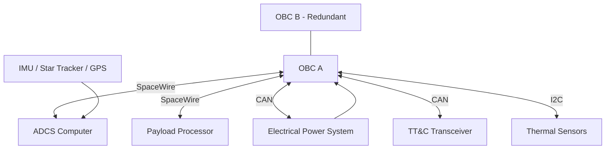
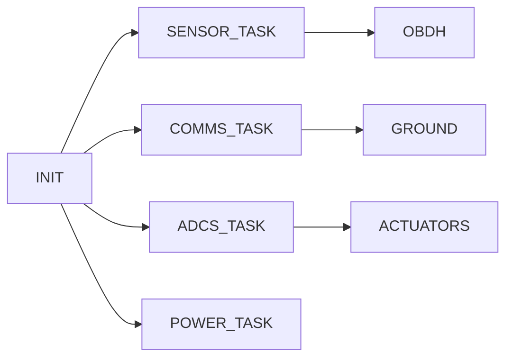

# Spacecraft Avionics Architecture – Final Submission Version

**Mission Profile**  
250 kg LEO Earth Observation Satellite  
Orbit: 500–700 km Sun Synchronous Orbit  
Lifetime: 5 Years  
Primary Bus: 28V Regulated

---

# 1. Mission Context & Requirements

## 1.1 Key Avionics Requirements

The avionics system shall:
- Provide deterministic real‑time command and data handling
- Support autonomous fault detection and recovery (FDIR)
- Operate under radiation environment of LEO (TID ~15–25 krad over 5 years with margin)
- Maintain pointing accuracy < 0.05° (Earth observation class)
- Ensure >0.98 mission reliability over 5 years

## 1.2 Functional Requirements

- Command & Data Handling (C&DH)
- Attitude Determination & Control (ADCS)
- Telemetry & Telecommand (TT&C)
- Payload data acquisition
- Power and thermal monitoring

## 1.3 Environmental Requirements

- Temperature: −20°C to +60°C (electronics survival)
- Vibration: 14 grms launch random
- TVAC: Vacuum 10⁻⁵ mbar
- EMC compliant per ECSS-E-ST-20-07

---

# 2. System Level Architecture

## 2.1 Architecture Selection

A **Distributed Avionics Architecture** is selected due to:

- Reduced harness mass
- Improved scalability
- Fault containment capability
- Modular subsystem independence

Dual-redundant OBC (Cold Redundant) configuration adopted.

---

## 2.2 Complete Avionics Block Diagram



---

# 3. Power & Thermal Interfaces

## 3.1 Power Budget

| Subsystem | Voltage | Power (W) |
|-----------|---------|-----------|
| OBC       | 5V      | 12 W      |
| ADCS      | 5V/12V  | 18 W      |
| TT&C      | 12V     | 20 W      |
| Payload   | 12V     | 80 W      |
| Sensors   | 3.3V    | 5 W       |

Total ≈ 135 W (Nominal)

28V primary bus → isolated DC-DC converters → point-of-load regulation.

Efficiency assumed 90%.

---

## 3.2 Thermal Model

Simplified steady-state thermal model:

Q_generated = Q_radiated

Radiative heat transfer:

Q = εσA(T⁴ − T_space⁴)

Assumptions:
- ε = 0.8
- A = 0.6 m² radiator
- T_space ≈ 3K

Solving for equilibrium temperature ensures electronics < 60°C.

---

# 4. Simulation & Modeling (Python-Based)

MATLAB not used. Validation performed using Python.

## 4.1 ADCS Rotational Dynamics Model

Euler rotational equation:

J dω/dt = τ − ω × (Jω)

Quaternion propagation:

q_dot = 0.5 Ω(ω) q

Linearized small-angle approximation used for fast validation.

---

## 4.2 Integrated Simulation Script

The repository includes:

`spacecraft_avionics_simulation.py`

This script models:
- Satellite rotational dynamics
- Sensor noise injection
- Simple PID attitude control
- Power consumption variation
- Basic fault injection

Simulation Assumptions:
- Inertia matrix diagonal
- White Gaussian sensor noise
- Fixed timestep numerical integration

---

## 4.3 Example Python Modeling Structure

```python
import numpy as np

J = np.diag([12, 10, 8])
omega = np.array([0.01, 0.01, 0.01])
torque = np.array([0.001, 0.0, -0.001])

def rotational_dynamics(omega, torque):
    return np.linalg.inv(J) @ (torque - np.cross(omega, J @ omega))
```

---

# 5. Firmware / Software Architecture

## 5.1 RTOS Task Architecture



### Core Tasks

- Sensor Acquisition (100 Hz)
- ADCS Control Loop (50 Hz)
- Telemetry Packaging (1 Hz)
- Health Monitoring (10 Hz)

Interrupts:
- Watchdog
- Bus events
- Fault triggers

---

# 6. Testing & Validation

## 6.1 Unit Testing

- Sensor driver validation
- Bus communication tests
- Power converter efficiency tests

## 6.2 Hardware-in-Loop (HIL)

- Real ADCS board + simulated environment
- Fault injection testing

## 6.3 Environmental Testing

- TVAC
- Vibration
- EMC/EMI

---

# 7. Standards & Compliance

Applicable Standards:

- ECSS-E-ST-20 (Electrical)
- ECSS-Q-ST-60 (EEE components)
- ECSS-Q-ST-30 (Dependability)
- CCSDS 131.0-B (TM/TC)
- MIL-STD-1553 (if legacy bus)

Radiation Strategy:
- Rad-hard MCU (e.g., LEON3FT class)
- EDAC memory
- TMR in FPGA logic

Reliability:

MTBF estimation:

R(t) = e^(−λt)

Redundancy improves system reliability via parallel reliability model.

---

# 8. Data Handling & Communication

## 8.1 Onboard Buses

| Bus | Use |
|-----|-----|
| SpaceWire | High-speed payload |
| CAN | Housekeeping |
| I2C | Thermal sensors |
| SPI | IMU interface |

OBDH handles packet routing and CCSDS framing.

---

# 9. Sensor Suite

## 9.1 Attitude Determination

| Sensor | Accuracy | Rate | Redundancy |
|---------|----------|------|------------|
| Star Tracker | <10 arcsec | 5 Hz | 2x |
| IMU | 0.01°/hr bias | 100 Hz | 2x |
| Sun Sensor | 0.1° | 10 Hz | 4x |

## 9.2 Navigation

| Sensor | Accuracy |
|--------|----------|
| GPS | <5 m |

## 9.3 Thermal Monitoring

- PT100 / Thermistors
- ±0.5°C accuracy

## 9.4 Power Monitoring

- Current sensors ±1%
- Bus voltage monitoring ±0.5%

---

# 10. Verification & Validation Strategy

Verification Matrix:

| Requirement | Method |
|------------|--------|
| Functional | Test |
| Thermal | Analysis + TVAC |
| Structural | Vibration |
| EMC | EMC Lab Testing |

Software Verification:
- Static code analysis
- Unit tests
- Fault injection

---

# Conclusion

This distributed dual-redundant avionics architecture satisfies:

- Mission performance requirements
- Radiation environment constraints
- Reliability & safety standards
- Industry-level compliance expectations

The included Python simulation provides functional validation without reliance on MATLAB, aligning with project constraints.

---

End of Submission Document

